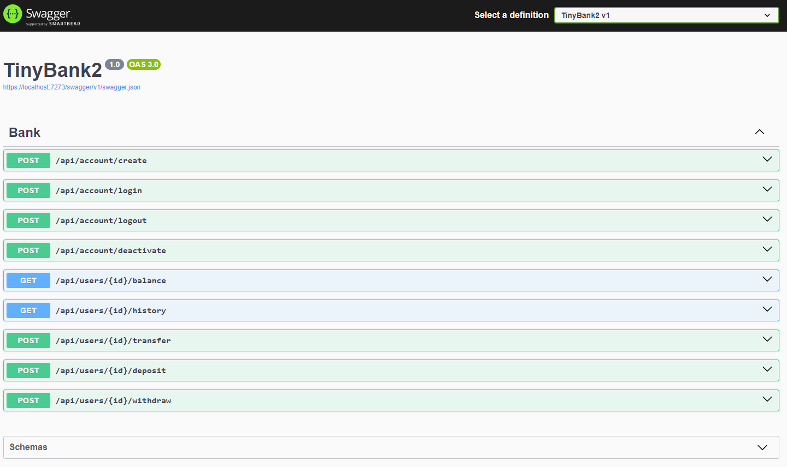
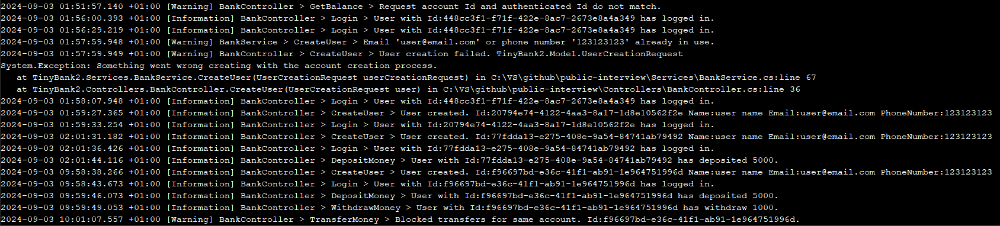

# Tiny Bank Assessment 2.0

## Setup local environment

- Clone repository
- Open powershell in the cloned repository
- Run the project

```
dotnet run --environment Development
```

## Application Swagger documentation

- **SWAGGER**: https://localhost:7273/swagger/index.html
  

## Raw HTML to navigate in the application

- **RawHtml**: https://localhost:7273/index.html

## Implemented features

- Users can create a new account
  - accounts should be unique, validated by email and phone number

```
curl --location 'https://localhost:7273/api/Account/Create' \
--header 'Content-Type: application/json' \
--data-raw '{"name": "user name", "email": "user@email.com", "phoneNumber": "123123123", "password": "user123", "address": "User street 47"}'
```

- Users can login after they've created a new account (session cookie will be created with 1 hr TTL)

```
curl --location 'https://localhost:7273/api/Account/Login' \
--header 'Content-Type: application/json' \
--data-raw '{"email": "user@email.com", "password": "user123"}'
```

- Users can logout after they've created a new account (session cookie TTL is set to zero)

```
curl --location --request POST 'https://localhost:7273/api/Account/Logout' \
--header 'Cookie: AuthToken={{auth-cookie-value}}'
```

- Users can deactivate their account.
  - deactivated accounts can no longer login

```
curl --location --request POST 'https://localhost:7273/api/Account/Deactivate' \
--header 'Cookie: AuthToken={{auth-cookie-value}}'
```

- Once logged in, a user can perform any of the listed operations below (authentication & ownership validations in place)

  - Check balance

```
curl --location 'https://localhost:7273/api/Users/{{id}}/Balance' \
--header 'Cookie: AuthToken={{auth-cookie-value}}'
```

- Check transaction history

```
curl --location 'https://localhost:7273/api/Users/{{id}}/history' \
--header 'Cookie: AuthToken={{auth-cookie-value}}'
```

- Deposit money

  - Negative values protection is in place

```
curl --location 'https://localhost:7273/api/Users/{{id}}/deposit' \
--header 'Content-Type: application/json' \
--header 'Cookie: AuthToken={{auth-cookie-value}}' \
--data '{
    "amount": 5000
}'
```

- Withraw money

  - Negative values protection is in place

```
curl --location 'https://localhost:7273/api/Users/{{id}}/Withdraw' \
--header 'Content-Type: application/json' \
--header 'Cookie: AuthToken={{auth-cookie-value}}' \
--data '{
    "amount": 1000
}'
```

- Transfer money to another account (by account ID)

  - Negative values protection is in place
  - Transfers from/to same account are protected

```
curl --location 'https://localhost:7273/api/users/f96697bd-e36c-41f1-ab91-1e964751996d/transfer' \
--header 'content-type: application/json' \
--header 'cookie: AuthToken={{auth-cookie-value}}' \
--data '{"destinationAccount":"f96697bd-e36c-41f1-ab91-1e964751996d","amount":500,"description":"Transfer"}'
```

- Application is logging vast operations, providing useful information
  
